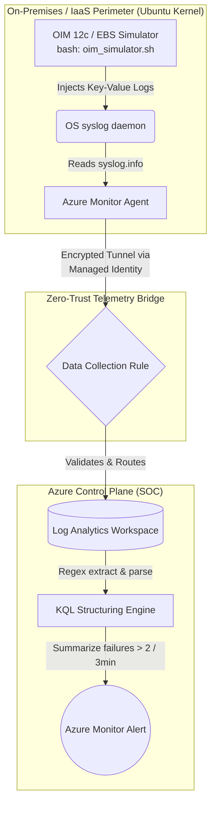

# Hybrid Identity Governance & SOX Audit Pipeline

[](https://azure.microsoft.com/)
[](https://ubuntu.com/)
[]()
[]()

## Executive Summary
This project demonstrates the transition of legacy on-premises identity operations (Oracle Identity Manager 12c & Oracle EBS R12) into a modern, automated, and SOX-compliant cloud telemetry pipeline. By leveraging Azure Infrastructure as Code (IaC) and Zero-Trust binding principles, this architecture captures, parses, and aggregates unstructured Linux kernel events into structured Security Operations Center (SOC) alerts.

## 🏗 Architecture & Data Flow

The pipeline enforces a strict boundary between the identity data plane (Linux OS) and the security control plane (Azure). Static credentials are intentionally omitted in favor of System-Assigned Managed Identities.



## 🛠 Technology Stack
* **Infrastructure as Code (IaC):** Azure Bicep (Declarative provisioning of compute and LAW).
* **Identity & Access Management:** Azure Managed Identities (System-Assigned).
* **Telemetry & Ingestion:** Azure Monitor Agent (Linux), Data Collection Rules (DCR).
* **OS Simulation:** Linux Bash (`logger`, `syslog`, Modulo randomization).
* **Security Analytics:** Kusto Query Language (KQL), Azure Monitor Alerts.

---

## 🚀 Deployment & Infrastructure Execution

### 1. Provisioning the Environment
The base environment (Ubuntu VM and Log Analytics Workspace) is deployed declaratively using Azure Bicep.

### 2. Establishing the Zero-Trust Bridge (Imperative Binding)
To ensure secure telemetry traversal without service accounts, the infrastructure is bound using the Azure CLI:

```bash
# Assign System-Assigned Managed Identity to the VM
az vm identity assign --resource-group <RG_NAME> --name dummyvm

# Deploy the Azure Monitor Linux Agent
az vm extension set --name AzureMonitorLinuxAgent --publisher Microsoft.Azure.Monitor --resource-group <RG_NAME> --vm-name dummyvm --enable-auto-upgrade true

# Bind the Data Collection Rule (DCR) to the VM via the Managed Identity
az monitor data-collection rule association create --name "dummyvm-association" \
  --resource "/subscriptions/<SUB_ID>/resourceGroups/<RG_NAME>/providers/Microsoft.Compute/virtualMachines/dummyvm" \
  --rule-id "/subscriptions/<SUB_ID>/resourceGroups/<RG_NAME>/providers/Microsoft.Insights/dataCollectionRules/<DCR_NAME>"
```

---

## 🧬 Kernel-Level Simulation (`oim_simulator.sh`)

To validate the ingestion pipeline, synthetic Oracle Identity lifecycle events are generated directly inside the Ubuntu kernel. 

**Architectural Note on DCR Bypassing:** Initial payload generation targeted the `auth.info` facility. However, rigid DCR configurations often drop authentication logs to optimize bandwidth. To ensure successful traversal, the payload disguises itself using the `syslog.info` facility.

```bash
#!/bin/bash
# Simulates enterprise identity events (Provisioning, Entitlement, Revocation, Auth Failure)
USERS=("kramesh" "psrinivas" "jdoe" "asmith" "svc_ebs_admin")
APPS=("OIM_12c" "Oracle_EBS_R12" "Azure_AD")

while true; do
    # ... randomization logic ...
    MSG="OIM_AUDIT: [EVENT=AUTH_FAILURE] [STATUS=FAILED] [USER=$RAND_USER] [TARGET_APP=$RAND_APP] [ACTION=Login_Attempt] [REASON=Invalid_Credentials]"
    logger -p syslog.info -t OIM_GOVERNANCE "$MSG"
    sleep $(( ( RANDOM % 4 )  + 2 ))
done
```


---

## 🔍 Security Analytics & Threat Detection (KQL)

Raw syslog data is monolithic and unusable for SOX compliance audits. The pipeline utilizes advanced KQL to structure the data and aggregate anomalies.

### The Data Structuring Engine
Transforms raw Linux strings into relational, filterable columns using Regex extraction.
```kusto
Syslog
| where SyslogMessage contains "OIM_AUDIT"
| extend Event_Type = extract(@"\[EVENT=([^\]]+)\]", 1, SyslogMessage)
| extend Target_User = extract(@"\[USER=([^\]]+)\]", 1, SyslogMessage)
| extend Application = extract(@"\[TARGET_APP=([^\]]+)\]", 1, SyslogMessage)
| project TimeGenerated, Event_Type, Target_User, Application
```


### The SOC Alerting Threshold
Identifies potential brute-force or misconfigured service account behaviors. Triggers an alert if a single identity fails authentication multiple times within a rolling window.
```kusto
// Filters for AUTH_FAILURE and aggregates counts
| summarize FailureCount = count() by Target_User, Application, Failure_Reason, bin(TimeGenerated, 3m)
| where FailureCount >= 2
| order by TimeGenerated desc
```


---

## 📈 Business Impact & SOX Compliance
This architecture directly satisfies enterprise IT General Controls (ITGC) requirements by:
1. **Immutable Audit Trails:** Forcing legacy application logs into an immutable cloud data store.
2. **Automated Threat Detection:** Replacing manual log reviews with KQL-driven aggregation rules.
3. **Identity-First Security:** Providing immediate visibility into Segregation of Duties (SoD) violations and unauthorized access attempts across hybrid environments.
